# WITShift

[](https://github.com/aantenore/witshift/actions/workflows/ci.yml)

WITShift is a fail-closed migration CLI and conformance lab for a deliberately restricted subset of
static TypeScript MCP v1 stdio tools. It inventories contracts, emits a real WebAssembly Component
through the official Bytecode Alliance toolchain, generates a candidate least-privilege policy, and
compares replaceable execution adapters.

The alpha is intentionally narrow. It is not a TypeScript compiler, a sandbox, or proof that
Wassette enforced a policy. Ambiguous source stops before component generation.

## What works

- `inspect` discovers literal `registerTool` calls, static Zod/JSON schemas, imports, and coarse
  capabilities.
- `build` invokes pinned [jco](https://github.com/bytecodealliance/jco) 1.25.2 and
  ComponentizeJS 0.21.0, then validates that the output is a Component rather than a core module.
- `verify` runs bounded JSONL fixtures through replaceable original and component ports, validates
  schemas, compares canonical JSON, and records denial evidence.
- The CI runtime gate componentizes and executes the weather sample through jco's WebAssembly
  Component transpilation path.
- Every artifact is paired with hashes and human-readable evidence.

The remaining Wassette loading and runtime-denial gate is explicit in
[docs/wassette-gate.md](docs/wassette-gate.md).

## Lifecycle

```mermaid
flowchart LR
  A["Static MCP v1 source"] --> B["inspect: contracts and rejection evidence"]
  B -->|supported| C["build: WIT, component source, policy"]
  C --> D["official jco and ComponentizeJS"]
  D --> E["real component.wasm and provenance manifest"]
  E --> F["verify: differential fixtures and policy probes"]
  F --> G["test-only or component-runtime evidence"]
  G -. open alpha gate .-> H["Wassette runtime evidence"]
```



## Quick start from source

Node.js 24 or newer and Corepack are required.

```bash
corepack enable
pnpm install --frozen-lockfile
pnpm build

node dist/bin.js doctor samples/weather
node dist/bin.js inspect samples/weather
node dist/bin.js build samples/weather --out samples/weather/.witshift/build
node dist/bin.js verify samples/weather --fixtures samples/weather/fixtures/verify.jsonl
```

The repository pins the official component toolchain and replaces only its unmaintained archive
extractor with the maintained, patched fork. The packed WITShift core declares the toolchain as
optional peers so it does not silently install an unsafe transitive graph. See the
[runbook](docs/runbook.md#secure-toolchain-setup) for consumer setup.

## Commands

| Command                                           | Output                                                                 |
| ------------------------------------------------- | ---------------------------------------------------------------------- |
| `witshift doctor [project]`                       | Configuration and local toolchain versions                             |
| `witshift inspect <project> [--report-dir <dir>]` | Static inventory plus JSON/Markdown rejection evidence                 |
| `witshift build <project> --out <dir>`            | WIT, generated source, policy, real component, manifest, build report  |
| `witshift verify <project> --fixtures <jsonl>`    | Differential and policy evidence in JSON and Markdown                  |
| `witshift build ... --no-cache`                   | Direct upstream bytes, with no delivery stabilization                  |
| `witshift build ... --no-reproducibility-check`   | One componentization, explicitly reported as not independently checked |

Place `--json` before or after a command for a single canonical JSON value. Machine-readable errors
have `ok: false`, a stable code, a message, and an exit code; stack traces are not emitted.

| Exit | Meaning                                    |
| ---: | ------------------------------------------ |
|    0 | Success                                    |
|    2 | Invalid arguments or fixtures              |
|    3 | Invalid configuration or adapter           |
|    4 | Source outside the supported static subset |
|    5 | Component toolchain or artifact failure    |
|    6 | Differential or expected-policy mismatch   |
|    7 | Bounded file I/O failure                   |
|    8 | Unexpected internal failure                |

## Verification evidence is not interchangeable

- `test-only`: deterministic adapters or the generated allow-list evaluator. Useful for contracts;
  not runtime isolation.
- `component-runtime`: the emitted component actually executed in a component-capable path. This is
  the current runtime smoke level.
- `wassette-runtime`: reserved for captured Wassette invocation and denial evidence. The alpha does
  not emit this label by default.

The weather sample is a positive vertical slice. The filesystem sample deliberately fails
inspection to demonstrate that arbitrary Node.js filesystem calls are not disguised as a migration.

## Reproducibility

The manifest serialization is canonical; its values describe the artifact actually delivered.
Independent ComponentizeJS runs can currently produce different component bytes for identical
inputs. With caching enabled, WITShift admits one component under a hash-bound cache key and verifies
it on reuse. That creates stable repeat delivery, not a clean-room reproducibility claim. `--no-cache`
exposes direct upstream behavior.

## Documentation

- [Supported feature matrix](docs/supported-features.md)
- [Threat model](docs/threat-model.md)
- [Operator runbook](docs/runbook.md)
- [Wassette promotion gate](docs/wassette-gate.md)
- [Delivery contract](docs/delivery-contract.md)
- [Architecture decisions](docs/adr/0001-build-vs-buy.md)
- [Changelog](CHANGELOG.md)

## License

Apache-2.0. See [LICENSE](LICENSE) and [NOTICE](NOTICE).
